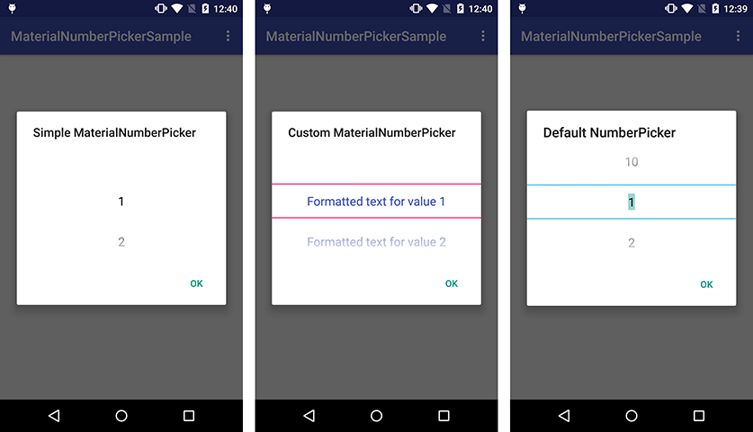

# MaterialNumberPicker
This library intends to give you more flexibility than the Holo `NumberPicker` that only comes with two themes for customization.

As many Android developers complained about this component since it was released, this library allows you to access some most wanted private attributes through reflection so that you could easily customize your NumberPicker. This lets you get closer from the `MaterialDesign` guidelines!

Finally, we built on top of it a builder pattern so you can easily create your `MaterialNumberPicker` from XML or programmatically.



## Download
MaterialNumberPicker requires at minimum Android 3.0, same as the native NumberPicker.

Gradle:

```groovy
compile 'biz.kasual:materialnumberpicker:1.2.1'
```

Maven:

```xml
<dependency>
  <groupId>biz.kasual</groupId>
  <artifactId>materialnumberpicker</artifactId>
  <version>1.2.1</version>
  <type>aar</type>
</dependency>
```

Eclipse: [materialnumberpicker-1.2.1.aar](https://github.com/KasualBusiness/MaterialNumberPicker/releases/download/1.2.1/materialnumberpicker-1.2.1.aar)

## Usage

You can either define your `MaterialNumberPicker` via XML or programmatically :

```xml
<biz.kasual.materialnumberpicker.MaterialNumberPicker
        android:layout_width="match_parent"
        android:layout_height="match_parent"
        app:npMinValue="1"
        app:npMaxValue="50"
        app:npDefaultValue="10"
        app:npBackgroundColor="@color/colorAccent"
        app:npSeparatorColor="@color/colorAccent"
        app:npTextColor="@color/colorPrimary"
        app:npTextSize="25sp"/>
```

```java
MaterialNumberPicker numberPicker = new MaterialNumberPicker.Builder(context)
                .minValue(1)
                .maxValue(10)
                .defaultValue(1)
                .backgroundColor(Color.WHITE)
                .separatorColor(Color.TRANSPARENT)
                .textColor(Color.BLACK)
                .textSize(20)
                .enableFocusability(false)
                .wrapSelectorWheel(true)
                .build();
```

The latter option only builds the picker for you. It is up to you how you want to display the picker. You can as well insert it in any `ViewGroup` or inside an `AlertDialog` as a custom view.

````java
new AlertDialog.Builder(this)
                .setTitle(yourTitle)
                .setView(numberPicker)
                .setPositiveButton(getString(android.R.string.ok), new DialogInterface.OnClickListener() {
                    @Override
                    public void onClick(DialogInterface dialog, int which) {
                        Snackbar.make(findViewById(R.id.your_container), "You picked : " + numberPicker.getValue(), Snackbar.LENGTH_LONG).show();
                    }
                })
                .show();
```

By default there is no `NumberPicker.Formatter` when you build your `MaterialNumberPicker` but you can easily attach one to it using the `formatter` builder proprety.

## License

```
Copyright 2015 Kasual Business.

Licensed under the Apache License, Version 2.0 (the "License");
you may not use this file except in compliance with the License.
You may obtain a copy of the License at

   http://www.apache.org/licenses/LICENSE-2.0

Unless required by applicable law or agreed to in writing, software
distributed under the License is distributed on an "AS IS" BASIS,
WITHOUT WARRANTIES OR CONDITIONS OF ANY KIND, either express or implied.
See the License for the specific language governing permissions and
limitations under the License.
```
